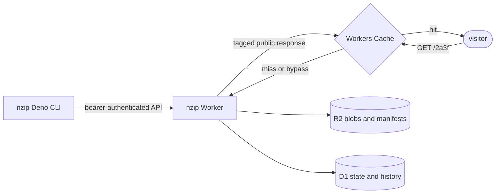
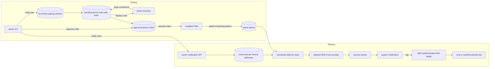
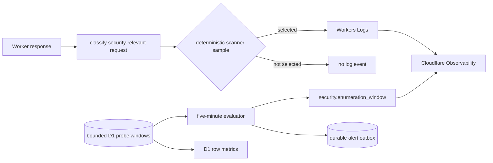

# nzip architecture

nzip is a Deno CLI backed by a Cloudflare Worker, R2 object storage, and D1 relational state. The
CLI and Worker share one runtime-neutral package so both sides canonicalize and hash manifests
identically.

## Components

- `shared/` defines manifests, hashing, target parsing, limits, media types, and API contracts.
- `cli/` bundles local files, uploads missing blobs, commits sites, and manages owner operations.
- `worker/` serves public sites and implements authenticated management, security telemetry,
  notifications, cleanup, and delivery retries.

## Push protocol

A push is a stateless three-step exchange; the manifest is the state carried between steps:

1. `POST /api/push/prepare` sends the manifest and returns missing blob hashes.
2. `PUT /api/blob/{sha256}` uploads only missing blobs, with bounded concurrency. The Worker
   re-hashes each body and rejects mismatches or oversized blobs.
3. `POST /api/push/commit` verifies every blob, resolves or allocates the address, applies TTL and
   password policy, repoints the site, and appends retained history atomically.

Content-addressed blobs deduplicate across every site. The last ten pushes per site remain
addressable for revert operations.

## Serving and caching

Serving normally requires one D1 read for site state and two R2 reads for the manifest and file.
Public responses use `ETag` revalidation and a 60-second Workers Cache entry. Cache hits skip Worker
execution and storage reads, although they still count as Worker requests.

Public responses carry a site cache tag. Pushes, reverts, deletion, TTL changes, and password-policy
changes purge that tag. Protected responses and errors are never publicly cached.

Single-file sites serve at the bare address. Multi-file sites redirect to the trailing-slash form so
relative asset paths resolve correctly.

## Storage model

Core publishing state:

| table    | purpose                                                              |
| -------- | -------------------------------------------------------------------- |
| `vaults` | named vault slots, descriptions, and site grouping                   |
| `sites`  | address, vault, alias, current manifest, expiry, and password policy |
| `pushes` | retained per-site manifest history                                   |

Security and notification state:

| table                         | purpose                                              |
| ----------------------------- | ---------------------------------------------------- |
| `security_probes`             | deduplicated scanner/address observations            |
| `security_signals`            | rate-limit and suspicious-hit confirmations          |
| `security_incidents`          | alert lifecycle, severity, and suppression state     |
| `security_notifications`      | durable alert email outbox                           |
| `notification_pairing_window` | owner-controlled enrollment deadline                 |
| `notification_devices`        | pending, approved, active, and revoked device claims |
| `notification_events`         | bounded notification payloads and click targets      |
| `notification_deliveries`     | leased delivery attempts, retries, and outcomes      |

An R2 object is deleted only when no live site or retained history entry references it and it is
older than 24 hours. This prevents concurrent garbage collection from deleting an in-flight push.

## Notification flow

Notification setup separates enrollment, owner approval, and subscription attachment. Delivery is
also asynchronous: the owner request persists an event and per-device attempts before background
work contacts a Web Push provider.

Pairing codes cannot approve themselves; the approval path always requires the owner bearer token.
Subscription endpoints must match the configured provider-origin allowlist. Notification click
targets are resolved at tap time and open only the deployment root or the unchanged site manifest
recorded with the event.

## Background work

The five-minute schedule evaluates enumeration windows and drains notification deliveries. The daily
schedule expires sites, garbage-collects content, prunes telemetry and notification state, and sends
the security activity digest.

Durable outboxes separate request acceptance from email and Web Push delivery. Delivery workers use
leases, bounded retry schedules, and terminal outcomes so overlapping cron executions remain safe.

## Observability

Workers Logs provide sampled request-level context. D1 probe windows remain bounded but unsampled
for automatic incident decisions. D1 row metrics are the direct storage-budget signal.

## Free-tier design target

nzip is designed so a small personal deployment can stay inside Cloudflare's included usage. This is
a design target, not a guarantee: quotas are account-wide and Cloudflare may change them.

| resource      | bounding strategy                                       | usage reference                                                                                            |
| ------------- | ------------------------------------------------------- | ---------------------------------------------------------------------------------------------------------- |
| Workers       | short request path; cache before execution              | [Workers limits](https://developers.cloudflare.com/workers/platform/limits/)                               |
| Workers Cache | public content only; short TTL; mutation purge          | [Workers pricing](https://developers.cloudflare.com/workers/platform/pricing/)                             |
| Workers Logs  | invocation logs off; deterministic identity sample      | [Workers Logs pricing](https://developers.cloudflare.com/workers/observability/logs/workers-logs/#pricing) |
| D1            | deduplicated windows, write caps, and seven-day pruning | [D1 pricing](https://developers.cloudflare.com/d1/platform/pricing/)                                       |
| R2            | content deduplication, history cap, and daily GC        | [R2 pricing](https://developers.cloudflare.com/r2/pricing/)                                                |
| Alert email   | one verified Email Routing destination                  | [Email Service pricing](https://developers.cloudflare.com/email-service/platform/pricing/)                 |

Probe persistence happens after the public response and catches its own errors. Exhausting the
telemetry budget reduces detection coverage until quotas reset but does not stop ordinary site
serving.
