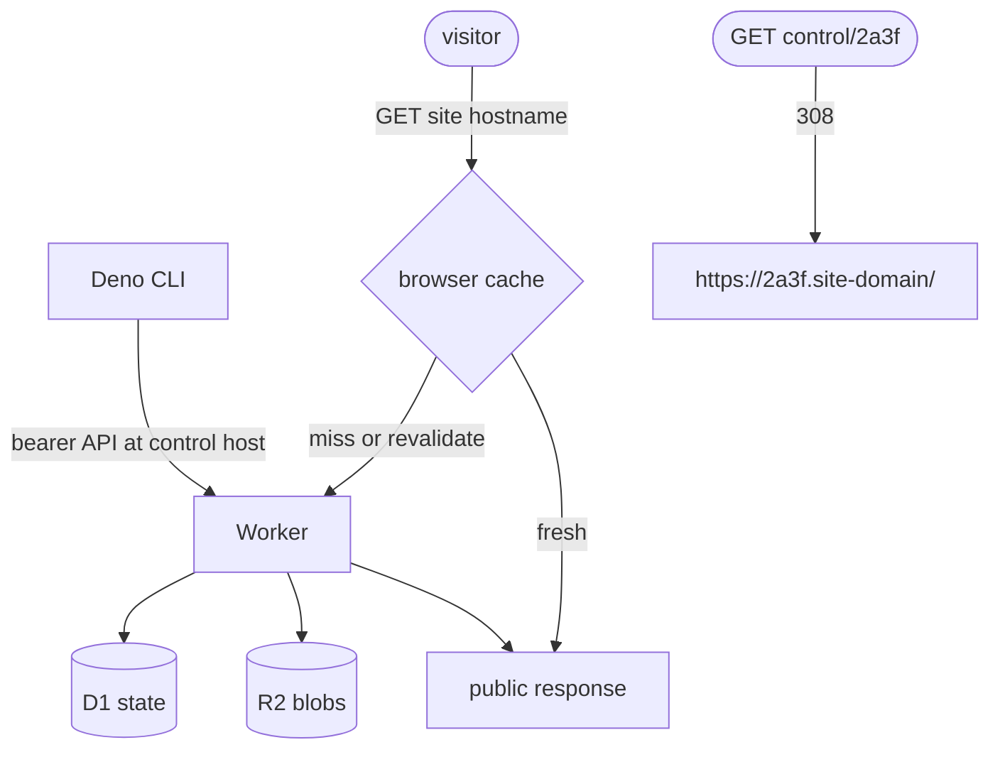
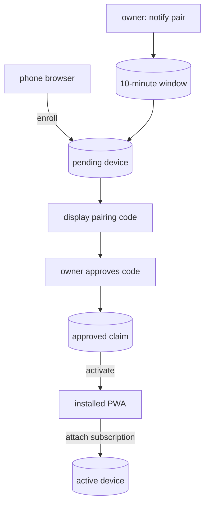
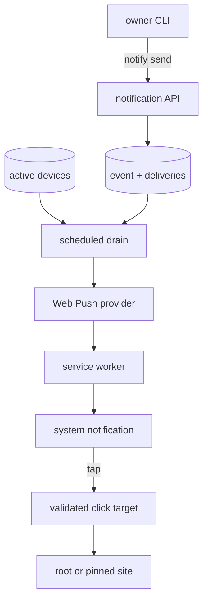
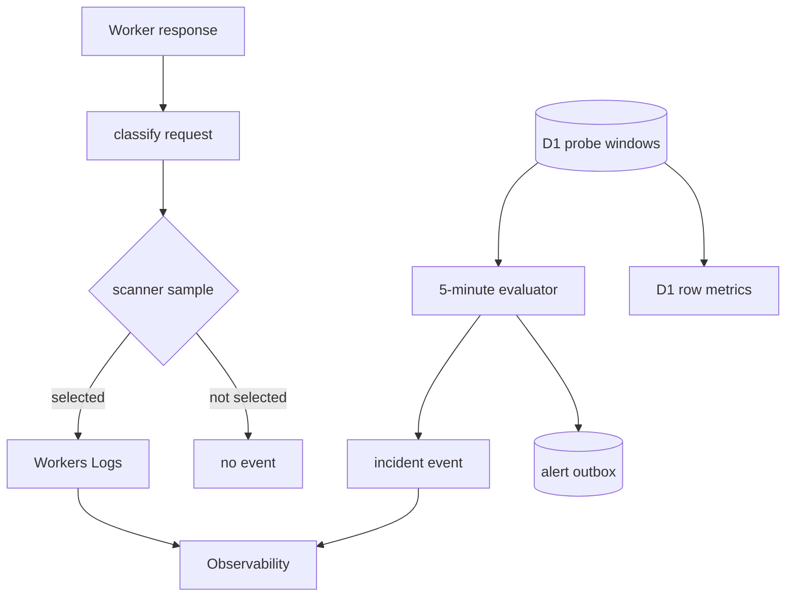

# nzip architecture

nzip is a Deno CLI backed by a Cloudflare Worker, R2 object storage, and D1
relational state. The CLI and Worker share one runtime-neutral package so both
sides canonicalize and hash manifests identically.

## Components

- `shared/` defines manifests, hashing, target parsing, limits, media types, and
  API contracts.
- `cli/` bundles local files, uploads missing blobs, commits sites, and manages
  owner operations.
- `worker/` serves public sites and implements authenticated management,
  security telemetry, notifications, cleanup, and delivery retries.

## Push protocol

A push is a stateless three-step exchange; the manifest is the state carried
between steps:

1. `POST /api/push/prepare` sends the manifest and returns missing blob hashes.
2. `PUT /api/blob/{sha256}` uploads only missing blobs, with bounded
   concurrency. The Worker re-hashes each body and rejects mismatches or
   oversized blobs.
3. `POST /api/push/commit` verifies every blob, resolves or allocates the
   address, applies TTL and password policy, repoints the site, and appends
   retained history atomically. TTL resolution is explicit request, existing
   site, vault default, then the 14-day global fallback; the response identifies
   the winning layer.

Content-addressed blobs deduplicate across every site. The last ten pushes per
site remain addressable for revert operations.

## App-origin reservation

`POST /api/apps` reserves a named address before content exists. The reservation
is separate from the live `sites` row and participates in allocation forever.
This gives lofi a stable origin before `credentialOrigins`, WebAuthn RP IDs,
service-worker scope, OPFS, or IndexedDB state are configured. A reservation
without content serves a small non-indexed placeholder. Deploying creates or
updates the ordinary site row at the reserved address; deletion and expiry may
remove that row but never the reservation tombstone.

The CLI's tracked `nzip.app.json` stores only framework, target, address, origin,
and build configuration. The owner bearer token remains solely in the mode-0600
CLI config. `app deploy` runs lofi's Deno build at the origin root, validates the
build identity and PWA artifacts, and sends the generated CSP with the commit so
the Worker can mirror it as an HTTP response header. Sync-node configuration is
application data and remains orthogonal to hosting.

## Serving and caching

The configured control origin owns authenticated APIs, notification enrollment,
and legacy short paths. A legacy `/<address>` request receives a permanent `308`
to `https://<address>.<site-domain>/`; the control origin never serves artifact
bytes. The wildcard route accepts only exact four-character lowercase
hexadecimal hostnames. Management and notification routes are not dispatched on
artifact hosts.

Each artifact hostname is a distinct browser origin. Origin-scoped storage and
service-worker control therefore stay within one site, and nzip's `__Host-`
unlock cookie is host-only. Artifact responses also disable `document.domain`
relaxation. Until `SITE_DOMAIN` is registered in the Public Suffix List, an
artifact can still set a parent-domain cookie or deliberately choose that parent
as its WebAuthn RP ID. Applications that require isolation must use host-only
cookies and their exact hostname as the RP ID.

Serving normally requires one D1 read for site state and two R2 reads for the
manifest and file. Public responses use `ETag` revalidation and a 60-second
browser cache entry. Every Worker response also sends
`Cloudflare-CDN-Cache-Control: no-store`: the exact custom domain and wildcard
route currently share an unsafe hostname-agnostic edge cache key, so an edge
entry must never be replayed on a sibling site origin.

Public responses retain site cache tags and purge hooks for a future host-safe
edge-cache design. Protected responses and errors are never cached.

Site roots always use `/`. Directory paths redirect to the trailing-slash form
so relative asset paths resolve correctly, and explicit `index.html` paths
redirect to their containing directory. For migration compatibility, an
unresolved `/<address>/...` asset path on that address's hostname falls back to
the corresponding root-relative asset. A real file at the prefixed path always
wins.

## Storage model

Core publishing state:

| table              | purpose                                                               |
| ------------------ | --------------------------------------------------------------------- |
| `vaults`           | named slots, descriptions, and optional default TTL                    |
| `vault_defaults`   | temporary/permanent lifecycle selection                               |
| `app_reservations` | permanent address and alias tombstones for application origins        |
| `sites`            | live address, manifest, expiry, password, and optional app CSP policy |
| `pushes`           | retained per-site manifest history                                    |

Security and notification state:

| table                         | purpose                                              |
| ----------------------------- | ---------------------------------------------------- |
| `security_probes`             | deduplicated scanner/address observations            |
| `security_signals`            | rate-limit and suspicious-hit confirmations          |
| `security_incidents`          | alert lifecycle, severity, and suppression state     |
| `security_notifications`      | durable alert email outbox                           |
| `notification_pairing_window` | owner-controlled enrollment deadline                 |
| `notification_devices`        | pending, approved, active, and revoked device claims |
| `notification_events`         | bounded notification payloads and click targets      |
| `notification_deliveries`     | leased delivery attempts, retries, and outcomes      |

An R2 object is deleted only when no live site or retained history entry
references it and it is older than 24 hours. This prevents concurrent garbage
collection from deleting an in-flight push.

## Notification flow

Notification setup separates enrollment, owner approval, and subscription
attachment. Delivery is also asynchronous: the owner request persists an event
and per-device attempts before background work contacts a Web Push provider.

Pairing codes cannot approve themselves; the approval path always requires the
owner bearer token. Subscription endpoints must match the configured
provider-origin allowlist. Notification click targets are resolved at tap time
and open only the deployment root or the unchanged site manifest recorded with
the event.

## Background work

The five-minute schedule evaluates enumeration windows and drains notification
deliveries. The daily schedule expires sites, garbage-collects content, prunes
telemetry and notification state, and sends the security activity digest.

Durable outboxes separate request acceptance from email and Web Push delivery.
Delivery workers use leases, bounded retry schedules, and terminal outcomes so
overlapping cron executions remain safe.

## Observability

Workers Logs provide sampled request-level context. D1 probe windows remain
bounded but unsampled for automatic incident decisions. D1 row metrics are the
direct storage-budget signal.

## Free-tier design target

nzip is designed so a small personal deployment can stay inside Cloudflare's
included usage. This is a design target, not a guarantee: quotas are
account-wide and Cloudflare may change them.

| resource      | bounding strategy                                       | usage reference                                                                                            |
| ------------- | ------------------------------------------------------- | ---------------------------------------------------------------------------------------------------------- |
| Workers       | short path; every browser miss executes the Worker      | [Workers limits](https://developers.cloudflare.com/workers/platform/limits/)                               |
| Workers Logs  | invocation logs off; deterministic identity sample      | [Workers Logs pricing](https://developers.cloudflare.com/workers/observability/logs/workers-logs/#pricing) |
| D1            | deduplicated windows, write caps, and seven-day pruning | [D1 pricing](https://developers.cloudflare.com/d1/platform/pricing/)                                       |
| R2            | content deduplication, history cap, and daily GC        | [R2 pricing](https://developers.cloudflare.com/r2/pricing/)                                                |
| Alert email   | one verified Email Routing destination                  | [Email Service pricing](https://developers.cloudflare.com/email-service/platform/pricing/)                 |

Probe persistence happens after the public response and catches its own errors.
Exhausting the telemetry budget reduces detection coverage until quotas reset
but does not stop ordinary site serving.
