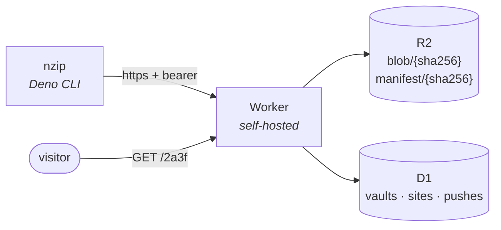

# `nzip`

**Push a directory of HTML from the terminal. Get a four-character URL back.**

_Deno CLI → Cloudflare Worker → R2 + D1. Zero-cost static site hosting with optional expiration
and/or password protection._

[](https://jsr.io/@nzip/cli)

[github.com/FelineStateMachine/nzip](https://github.com/FelineStateMachine/nzip) ·
[args.io/cat/nzip](https://args.io/cat/nzip)

```console
$ nzip push ./demo work:demo --ttl 30d
  bundling ./demo … 3 files, 197 B
  manifest 4a91d75d — 3 new blobs (197 B), 0 deduped
✓ pushed work:demo -> https://share.example.com/12d8  (expires in 30d, push #1)
```

---

## How addresses work

Every share lives at four hex characters. The first digit selects one of **16 registered vaults**,
the rest a site within it. Each vault holds 4,096 slots, allocated randomly so URLs don't leak how
many sites exist.

```text
https://share.example.com/2a3f
                          |+- site 0xa3f   (0x000-0xFFF, random within the vault)
                          +-- vault 0x2    ("work" - 16 slots, registered by name)
```

Aliases like `work:demo` are resolved by the API; the URL never exposes them. Commands accept any of
three target forms:

| form        | example     | meaning                    |
| ----------- | ----------- | -------------------------- |
| address     | `2a3f`      | direct hex address         |
| vault:alias | `work:demo` | alias within a named vault |
| bare alias  | `demo`      | alias in the default vault |

## Features

- **Instant.** A push is one manifest exchange plus the blobs the server hasn't seen. Nothing
  rebuilds, nothing redeploys.
- **Content-addressed.** Per-file sha256 blobs plus a canonical manifest per push. Identical files
  are stored once across every site; re-pushing an unchanged directory uploads `0 new blobs`.
- **Ephemeral by default.** 14-day TTL, with `--ttl 30d` or `--ttl forever` to override. Expired
  shares answer `410 Gone`; a daily cron sweeps them and garbage-collects unreferenced content.
- **Revertible.** The last 10 pushes per site are kept. `nzip revert` repoints the address at any of
  them, and the revert itself is recorded as a push.
- **Password-protectable.** `nzip push ./demo work:demo --password …` publishes the content and
  password policy atomically, then gates the site behind an unlock form (PBKDF2 hashing, signed
  per-site cookie, 7 days). Use `nzip site` to change protection later.
- **Single-user by design.** One bearer token, stored as a Worker secret and in
  `~/.config/nzip/config.json` (mode 0600).
- **Locates itself.** `nzip where <target>` prints the local directory this machine pushed a site
  from. A breadcrumb registry (`~/.config/nzip/paths.json`) records the source path on every push
  and self-cleans: expired entries drop on write, `rm` forgets its entry, and `ls` reconciles
  against the live set. Use it as `cd "$(nzip where personal:plan)"`.
- **Vault guardrail.** An optional `"allowVaults": ["home"]` in `config.json` restricts which vaults
  this install may target by name. Pushes or aliases outside the list are refused before any upload,
  so a home-project agent can't drop a doc into a vault that sits adjacent to what you share
  professionally. Absent = unrestricted; raw hex addresses bypass it (they name no vault).

## Commands

```text
nzip auth [--server URL] [--token T]     authenticate and save config
nzip vault add <name> [--slot N]         register a vault (16 slots, 0x0–0xf)
nzip vault ls | default <name>           list vaults / set the default
nzip push <dir|file> [target] [--ttl …] [--password PW | --no-password]
nzip download <target> [dir] [--overwrite]  recover the current hosted bundle
nzip site <target> [--ttl …] [--password PW | --no-password]
nzip ls [vault]                          list sites
nzip where <target>                      print the local dir this machine pushed from
nzip rm <target> [--yes]                 delete a site
nzip status                              server + vault overview
nzip revert <target> [--to N] [--list]   repoint to a previous push
```

Password and TTL are committed with the content. On a new site, omitting `--password` creates an
unprotected site; on an existing target, omission preserves its current password. Pass
`--no-password` to clear protection explicitly. The former `nzip share` command remains available
as a compatibility alias for `nzip site`.

Pushing a single `page.html` stores it as the site's `index.html`. Directory pushes skip dotfiles
and `node_modules`, and honor a `.nzipignore` (one glob per line). Single-file sites serve directly
at the bare address (`/2a3f`); multi-file bundles redirect to `/2a3f/` so relative asset URLs
resolve.

`nzip download work:demo ./recovered-demo` recovers the exact current bundle from the authenticated
server when the original local directory is unavailable. It refuses non-empty destinations unless
`--overwrite` is passed, and verifies every downloaded file against the hosted manifest. It can only
restore uploaded files—not dotfiles, `.nzipignore`, or other local project metadata excluded from a
push.

## Architecture



A push is a stateless three-step protocol, and the manifest itself is the state:

1. `POST /api/push/prepare`: send the manifest, get back which blob hashes the server is missing
2. `PUT /api/blob/{sha256}`: upload only those, one per request, 6 at a time; the server re-hashes
   and rejects mismatches
3. `POST /api/push/commit`: the server re-verifies every blob exists, then commits atomically,
   resolving or allocating the address, applying TTL/password policy, repointing the site, and
   appending history

Serving is one D1 read (address → manifest, expiry, password) and two R2 reads, with `ETag`
revalidation and a 60-second cache. Metadata lives in three tables:

| table    | keys                                                                     |
| -------- | ------------------------------------------------------------------------ |
| `vaults` | slot (0–15), name                                                        |
| `sites`  | address (0–65535), vault, alias, current manifest, expiry, password hash |
| `pushes` | per-site history (seq, manifest, note), capped at 10, powers `revert`    |

**GC safety rule:** an R2 object is deleted only if no live site or retained history entry
references it _and_ it's older than 24 hours, so an in-flight push can never lose objects to a
concurrent sweep.

## Repo layout

```text
shared/   manifest canonicalization, hashing, addressing (imported by both sides)
cli/      the nzip command (Deno, no framework), published as jsr:@nzip/cli
worker/   Cloudflare Worker: serving + API + GC cron (wrangler)
```

`shared/` is the contract: canonical JSON serialization lives in exactly one file
([`shared/manifest.ts`](shared/manifest.ts)) so the CLI and Worker can never disagree about a
manifest hash. It sticks to Web-standard APIs only, so the same code runs under Deno and workerd.

## Install

The CLI ships on [JSR](https://jsr.io/@nzip/cli). With [Deno](https://docs.deno.com/runtime/) on
your `PATH`, install it in one line, then point it at your server and push:

```sh
deno install -g -A -f -n nzip jsr:@nzip/cli    # 1. install the `nzip` command

nzip auth --server https://share.example.com   # 2. authenticate (prompts for the token)

nzip push ./site work:demo                     # 3. get a URL back
```

`nzip auth` prompts for anything you omit and saves it to `~/.config/nzip/config.json` (mode 0600),
so every later command just works. Upgrade any time by re-running the install line; try it without
installing via `deno run -A jsr:@nzip/cli --help`.

Adding a **second machine**? Only the CLI is per-machine; the Worker, R2, D1, vaults, and token are
already provisioned. Install from JSR and run `nzip auth` with the same server and token, and every
vault and site is instantly there. (The `nzip where` breadcrumb registry is local, so it only knows
sites pushed from this machine.)

`nzip` is self-hosted. The server URL is supplied by the operator; there is no bundled public
service. Use the same URL you set as `vars.PUBLIC_BASE` in your Wrangler config. Standing up that
server is the one-time setup below.

## Self-hosting: one-time Cloudflare setup

See [`worker/setup.md`](worker/setup.md) for the full checklist. In short:

```sh
cd worker
npx wrangler login
cp wrangler.local.example.jsonc wrangler.local.jsonc
# edit wrangler.local.jsonc:
# - routes[0].pattern: your hostname, such as share.example.com
# - vars.PUBLIC_BASE: https://<that hostname>
# - d1_databases[0].database_id: filled in after D1 creation
npx wrangler r2 bucket create nzip-content
npx wrangler d1 create nzip                       # paste id into wrangler.local.jsonc
npx wrangler d1 execute nzip --remote --file schema.sql
openssl rand -hex 32 | npx wrangler secret put NZIP_TOKEN --config wrangler.local.jsonc
npx wrangler deploy --config wrangler.local.jsonc
nzip auth --server https://share.example.com      # use your actual PUBLIC_BASE
```

`routes[0].pattern` and `vars.PUBLIC_BASE` are required for a real deployment. `PUBLIC_BASE`
controls the URLs returned by `nzip push`, and the CLI authenticates against that same origin.

Two gotchas learned the hard way:

- **Cron triggers require a workers.dev subdomain** on the account (API error `10063`), even if the
  Worker only serves a custom domain. Register one in the dashboard (or
  `PUT /accounts/{id}/workers/subdomain`) before deploying with `triggers`.
- The required custom-domain route
  (`"routes": [{ "pattern": "share.example.com",
  "custom_domain": true }]`) needs the zone on your
  account; it provisions DNS and the cert automatically on deploy.

## Development

```sh
deno task check                                   # typecheck CLI + shared
cd worker && npx tsc --noEmit                     # typecheck Worker

npx wrangler d1 execute nzip --local --file schema.sql   # once per fresh state
npx wrangler dev                                  # local R2/D1; token in .dev.vars
nzip auth --server http://localhost:8787 --token dev-token-local-only
```

Test the GC cron: `npx wrangler dev --test-scheduled`, then
`curl "http://localhost:8787/__scheduled?cron=0+4+*+*+*"`.
