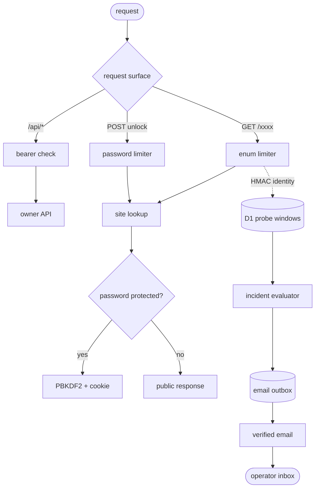

# nzip security

nzip is a personal, single-owner service. Its short public URLs are convenient addresses, not
secrets. Security comes from explicit authentication, password protection where needed, bounded
public surfaces, owner-approved device enrollment, and observable abuse controls.

Only publish content you trust. Sites hosted at `https://<deployment>/<address>/` share one browser
origin. They therefore share origin-scoped storage and credentials, including localStorage,
IndexedDB, OPFS, CacheStorage, and passkey relying-party identity. Path-scoped service workers and
unlock cookies do not create an isolation boundary: script in one site can request another site's
path, and the browser can attach that site's unlock cookie. Password protection gates
unauthenticated network access; it does not isolate mutually untrusted sites.

## Reporting a vulnerability

Do not disclose a vulnerability in a public issue. Use the repository's private security advisory
channel when available, or contact the repository owner privately. Include affected versions,
reproduction steps, impact, and any suggested mitigation.

## Trust boundaries

- Every `/api/*` management route requires the deployment-wide bearer token.
- The bearer token stays in Worker secrets and the CLI's mode-0600 configuration file; browsers and
  installed notification apps never receive it.
- Public site addresses occupy only 16 bits and should be treated as enumerable.
- Public sites are mutually trusted because all path-hosted addresses share the deployment origin.
  Use separate per-site hostnames before hosting mutually untrusted applications or relying on
  site-specific browser identity or storage isolation.
- Password-protected sites use PBKDF2 hashes and signed, versioned cookies. Changing password policy
  invalidates existing cookies immediately.
- Notification click targets are same-origin paths pinned to an existing site manifest. Arbitrary
  external URLs are rejected.
- Web Push subscription endpoints must match configured exact HTTPS provider origins. Wildcards,
  credentials, IP literals, alternate ports, and the deployment's own origin are rejected.

## Notification pairing

Pairing is closed by default. An authenticated owner opens a fixed 10-minute window with
`nzip notify pair`. The public root reveals the pairing action only during that window, and the
Worker enforces the same deadline when creating an enrollment.

Pairing codes are short-lived, normalized, and stored only as keyed hashes. A code identifies a
pending device but cannot approve itself; approval still requires the owner bearer token. Device
claims use `HttpOnly`, `Secure`, `SameSite=Lax`, host-only cookies and transition through pending,
approved, and active states before notifications can be delivered.

The root pairing surface cannot be framed. Pairing-state reads are same-origin and rate-limited, and
pending pages do not expose a second enrollment action.

## Enumeration controls

The address space is intentionally small, so nzip observes and limits enumeration rather than
claiming addresses are unguessable.

Raw client IPs are neither logged nor stored. Scanner identities are HMAC-derived. Probe rows are
deduplicated, capped per scanner and Cloudflare location, and pruned after seven days.

The evaluator opens or escalates incidents on these signals:

| severity  | signal                                                                 |
| --------- | ---------------------------------------------------------------------- |
| warning   | one scanner tries 20 distinct addresses in five minutes                |
| warning   | 128 addresses from 10 scanners with at least 90% misses                |
| confirmed | an enumeration request reaches the rate limiter                        |
| confirmed | a live hit follows sequence evidence or occurs during an open incident |

Duplicate alert email is suppressed unless severity increases, volume doubles, a live site is hit
for the first time, or a new vault is targeted after 30 minutes. Active incidents summarize at most
hourly and resolve after three quiet windows. Alert payloads are committed before delivery and
retried with stable notification identifiers.

## Operational monitoring

- Filter Workers Logs on `event = "security.request"` for sampled request context.
- Watch D1 row writes for the enumeration-telemetry budget.
- Keep the Email Routing destination verified and test it through the authenticated
  `/api/security/test-alert` endpoint.
- Treat notification titles and bodies as lock-screen-visible. Never include credentials, private
  URLs, or sensitive personal information.

Deployment configuration and security-alert setup are documented in
[`worker/setup.md`](worker/setup.md).
